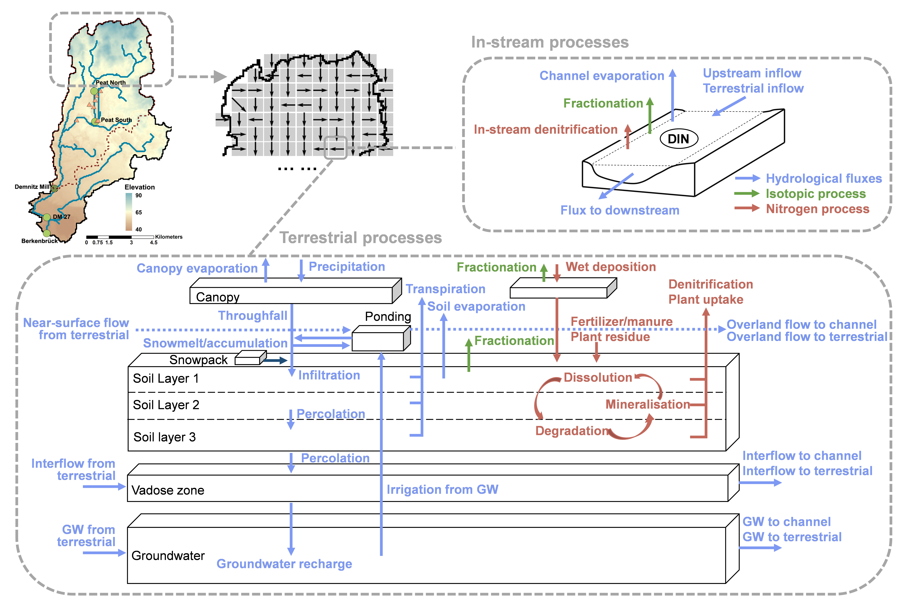

# EcoTWIN: an ECOhydrological model that Tracks Water, Isotopes, and Nutrients
## Introduction
EcoTWIN is a C++ ecohydrological frameworkaiming for simultaneous hydrological, isotopic, and nutrient modelling. It incorporates various process reprensentations from multiple models, with the flexibility to switch between different conceptualisations.  

Moreover, EcoTWIN has dynamical parameterisation scheme, which allows the model to update spatial discretization regularly (in user-defined timesteps). Such conceptualisation ensures the flexibility in representing changes in boundary conditions (e.g., land use changes due to managements).

## Model strucutre
The model conceptualisation derived from multiple models.  

The hydrological conceptualisation are adopted and modified from EcoPlot ([Landgraf et al., 2024](https://onlinelibrary.wiley.com/doi/10.1002/esp.5691)), EcH2O ([Maneta and Silverman, 2013](https://journals.ametsoc.org/view/journals/eint/17/11/2012ei000472.1.xml)), mHM ([Samaniego et al., 2010](https://agupubs.onlinelibrary.wiley.com/doi/full/10.1029/2008WR007327)).  

The isotopic module contains the mixing process and Craig-Gordon model, which is modified from EcH2O-iso ([Kupple et al., 2018](https://gmd.copernicus.org/articles/11/3045/2018/)).  

The nitrogen module are mainly based on [HYPE](https://hypeweb.smhi.se/) and mHM-Nitrate ([Yang et al., 2018](https://agupubs.onlinelibrary.wiley.com/doi/full/10.1029/2017WR022380)).

## Instruction
### 1 .Compliation  
Currently, EcoTWIN can only be deployed on Linux.  
For compilation, simply direct to ***Release-Linux*** and make.

    cd MODEL_PATH/Release_linux  
    make  
### 2. Configuration
The configuration of EcoTWIN is mainly based on the _config.ini_.  
A template is given in folder ***configs***.

- Specify the path of spetial inputs, climate inputs, and outputs in *Path section*.  
- Switch on/off isotopic and nutrient module in *Option section*. The conceptualisation of each process can also be switched between different modules.  
- Specify Climate, GIS, and Parameter inputs in corresponding sections.  
- Specify the fluxes/stages for output in *Reports section*  

### 3. Data preparation
Due to the flexible structure of EcoTWIN, the inputs are not fixed. The preparation of model inputs aligns with the configuration, and are documented in *config.ini*.

### 4. Execution
To run EcoTWIN, simply distribute all inputs and executable in the working directory into the following structure.
* **working_directory**  
  * **Spatial_path** (_folder contains all asc outputs; specified in config.ini_)  
     * dem.asc  
     * fdir.asc  
     * ...  
  * **Climate_path** (_folder contains all climate outputs; specified in config.ini_)  
    * P.bin   
    * T.bin  
    * ...  
  * **Output_path** (_folder contains all model outputs_)
  * **config.ini**  (_configuration file_)
  * **Crop_info.ini**  (_Crop information_)
  * **param.ini**  (_parameter names and values_)
  * **gEcoHydro**  (_GEM executable_)  
  
  
Then direct to the working directory, and run EcoTWIN.  

    cd working_directory
    gEcoHydro
